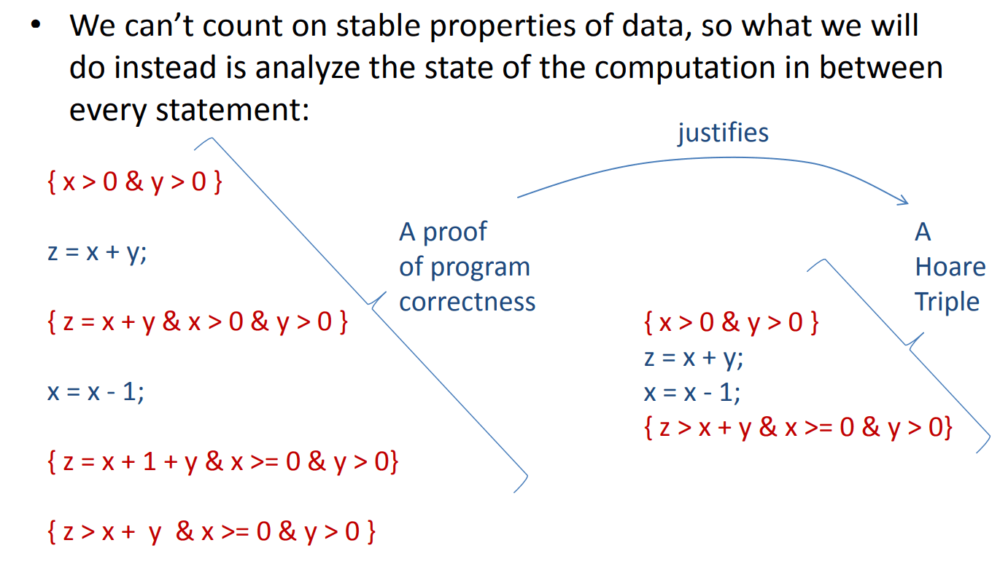

# week 4

## Higher-order Type Classes

Abstraction++ -> a little funny

- More abstraction: Higher-order type classes
- Kinds: Types for Types

we can also think of fmap as a function "lifts" another Haskell function in to a new domain

---

Overall, kinds are types for types - they describe and constrain
the way types are used to ensure there’s no nonsense

- Aside: without kinds, a language of types and type functions will be Turing-complete and type checking will be undecidable

---

Can kinds themselves be classified? Perhaps by super-kinds?

- Yes (though they aren’t typically called super-kinds)
- NuPrl (a sophisticated theorem prover) has infinite hierarchy
  of classifiers!
- But most languages stop at 3 levels (values, types, kinds)
- A few go to 4

---

Applicative functors allow you to "lift" computation in to some new domain

---

```hs
fmap f x = pure f <*> x
```

`fmap` simply applies a pure function to an encapsulated object

---

Haskell has some very general abstraction mechanisms

- polymorphic functions like map and foldr can be reused on container data structures (like lists) that contain different sorts
  of elements
- type classes make it possible to define one interface to be used over different sorts of containers

---

kinds control the way types and type constructors are used

- `*` is the kind of types
- `* -> *` is the kind of functions (like Maybe) from types to types

## Reasoning About Imperative Programs

In addition to having to worry about _what_ is true, you have to worry about _when_ it is true

### Hoare Logic

Hoare logic. (2022, November 29). In Wikipedia. https://en.wikipedia.org/wiki/Hoare_logic

We can’t count on stable properties of data, so what we will do instead is analyze the state of the computation in between every statement

```hs
{ precondition }

statement

{ assertion }

statement

{ assertion }

statement

{ postcondition }
```

precondition: describes requirements on initial state -- usually with some kind of logic

statement: each statement may have some effect on the state

assertion: describes the new state at exactly this program point

postcondition: guarantees properties of final state



!> x 已经更新了`x = x - 1`, 而`z`用的是之前的`x`

---

A (partial) Hoare triple has the form { P } C { Q } where

- P is a precondition that describes allowed initial states
- C is a (possibly compound C-like or Java-like) statement
- Q is a postcondition that describes allowed final states

A (partial) Hoare triple is valid if whenever we start in a state that satisfies the pre-condition P and execution of C terminates, we wind up in a state that satisfies Q

A fully annotated program `{P1} C1 {P2} C2 ... CK {PK+1}` serves as a proof of validity for the triple `{P1} C1 C2 ... CK {PK+1}` provided each individual components `{Pi} Ci {Pi+1}` obeys the Rules of Hoare Logic

---

**Partial Hoare Triples** are valid even when a program does not
terminate

**Total Hoare Triples** are valid if the partial triple is valid and the
program does terminate

Partial triples are good for establishing safety properties

- ie: certain “bad things” never happen
- eg: an array is never indexed out of bounds
- eg: a null pointer is never dereferenced

Total triples are good for establishing liveness properties:

- ie: eventually “something good” happens
- eg: the program terminates and produces an answer

Total triples are even more of a pain in the neck than partial ones so we are going to ignore them; fewer people use them

> 不是很能理解

### Program States

It is a **finite partial map** from program variables to integer values

finite: a finite number of elements
in the domain of the map

partial: not all variables are necessarily present (typically there are infinitely many possible variables)

map: function

---

Finite partial maps E typically support several operations:

- lookup: E(x)
- update: E[x = N]
- domain: dom(E)

```hs
module State where

type Var = String

type State = [(Var, Int)]

look :: State -> Var -> Maybe Int
look [] v = Nothing
look ((v', i) : xs) v =
  if v == v'
    then Just i
    else look xs v

up :: State -> Var -> Int -> State
up [] v i = [(v, i)]
up ((v', i') : xs) v i =
  if v == v'
    then (v, i) : xs
    else (v', i') : up xs v i

dom :: State -> [Var]
dom = map (\(v, i) -> v)
```

### Denotational Semantics

A denotational semantics gives a meaning to newly defined syntactic objects by translating these objects in to a better understood language or mathematical object

<table>
<tr>
<th>Math</th>
<th>Haskell</th>
</tr>
<tr>
<td>

```txt
integer variables
x := x1 | x2 | x3 | ... | y | z | ...
integer expressions
e ::= N | x | e + e | e * e
predicates
p ::= e = e | e < e
formulae
f ::= true
 | false
 | p
 | f & f
 | f || f
 | ~f
```

</td>
<td>

```hs
type Var = String

data Exp
  = Const Int
  | Var Var
  | Add Exp Exp
  | Mult Exp Exp

data Pred
  = Eq Exp Exp
  | Less Exp Exp

data Form
  = Tru
  | Fal
  | Pred Pred
  | And Form Form
  | Or Form Form
  | Not Form
```

</td>
</tr>
</table>

---

expressions

如翻译 js

```hs
esem :: State -> Exp -> Maybe Int
esem s (Const i) = Just i
esem s (Var v) = look s v
esem s (Add e1 e2) =
  case (esem s e1, esem s e2) of
    (Just i1, Just i2) -> Just (i1 + i2)
    (_, _) -> Nothing
esem s (Mult e1 e2) =
  case (esem s e1, esem s e2) of
    (Just i1, Just i2) -> Just (i1 * i2)
    (_, _) -> Nothing
```

> 表明`var`也是表达式

`case (esem s e1, esem s e2)` 递归到查找`var`的值, 这时需要`s`

---

Predicates

```hs
psem :: State -> Pred -> Maybe Bool
psem :: State -> Pred -> Maybe Bool
psem s (Eq e1 e2) =
  case (esem s e1, esem s e2) of
    (Just i1, Just i2) -> Just (i1 == i2)
    (_, _) -> Nothing
psem s (Less e1 e2) =
  case (esem s e1, esem s e2) of
    (Just i1, Just i2) -> Just (i1 < i2)
    (_, _) -> Nothing

psem s p == Just True  -- ====> "predicate p in state s is valid"
psem s p == Just False -- ====> "predicate p in state s is not valid"
psem s p == Nothing    -- ====> "predicate p is not defined in state s"
```

---

Formulae

```hs
fsem :: State -> Form -> Maybe Bool
fsem s Tru = Just True
fsem s Fal = Just False
fsem s (Pred p) = psem s p
fsem s (And f1 f2) =
  case (fsem s f1, fsem s f2) of
    (Just b1, Just b2) -> Just (b1 && b2)
    (_, _) -> Nothing
fsem s (Or f1 f2) =
  case (fsem s f1, fsem s f2) of
    (Just b1, Just b2) -> Just (b1 || b2)
    (_, _) -> Nothing
fsem s (Not f) =
  case fsem s f of
    Just b -> Just (not b)
    _ -> Nothing

fsem s f == Just True  -- ====> "formula f in state s is valid"
                       -- ====> "formula f describes state s"
fsem s f == Just False -- ====> "formula f in state s is not valid"
                       -- ====> "formula f does not describe state s"
fsem s f == Nothing    -- ====> "formula f is not defined in state s"
```

### What can we do with the semantics

We can determine which formulae are equivalent

Equivalent formulae describe the same set of states

f1 == f2 iff for all s, fsem s f1 == fsem s f2

> iff: if and only if

---

We can define the strength of a formula

f1 is stronger than f2 if f1 describes a subset of the states described by f2. Alternatively, f2 is weaker than f1.

we write f1 => f2 iff for all s, fsem s f1 == Just True implies fsem s f2 == Just True

P => Q means P is stronger than Q; P describes fewer states

> [蕴涵](https://zh.wikipedia.org/zh/%E8%95%B4%E6%B6%B5)

Implication (logic). (2020, December 23). In Wikipedia. https://simple.wikipedia.org/wiki/Implication_(logic)

### well-formed

We assume there is some (finite) set of variables G that are allowed to appear in expressions, formulae and programs

- An expression, formula, or program is well-formed if its variables are a subset of G

  the expression/formula/program only uses the allowed variables

- A state s is well-formed if dom(s) is a superset or equal to G

  s defines all of the allowed variables

---

fsem s f is never Nothing when s and f are well-formed

In this setting `f1 => f2` is the classical notion of logical implication
you are used to

!> 不会出现未定义这样的问题, 更加关注逻辑
