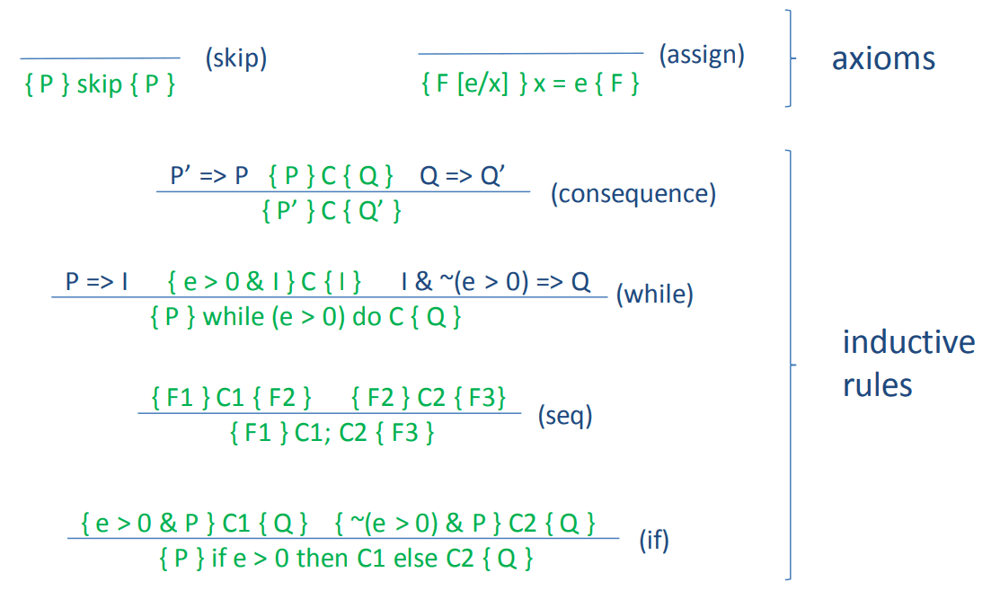

# week 5

We will use a standard mathematical convention _that when
the result of a function contains undefined parts, the entire result is considered undefined_

> Maybe

---

`(x * x) [ 2 + 3 / x ] == (2 + 3) * (2 + 3)`

`()`里面是 expression, `[]`里面是代换, `2 + 3`去代换`x`

## IMP

IMP: A SIMPLE IMPERATIVE LANGUAGE

IMP has three parts:

- integer variables, integer expressions and statements
- for simplicity, we’ve intentionally avoided having more than one type -- we are sticking with integers

```txt
integer variables
x := x1 | x2 | x3 | ... | y | z | ...
integer expressions
e ::= N | x | e + e | e * e
statements (aka Commands)
C ::= x = e (an assignment)
 | skip (a no-op)
 | C; C (sequencing)
 | if (e > 0) then C else C (if statement)
 | while (e > 0) do C (while loop)
```

## A HOARE LOGIC FOR IMP

`{P} C {Q}`:

A Hoare triple is valid if whenever we start in a state that satisfies the pre-condition P and execution of C terminates, we wind up in a state that satisfies Q

> Hoare triple: `{P} C {Q}`, monadic style: `P >>= C -> Q`

---

Strategy for devising rules:

- For each simple imperative statement, we define a rule
- For each compound statements, we define a rule
  - these rules typically use proofs about the underlying statements
- Finally, we have a few "structural" rules that help us glue proof pieces together

> 可以看出也是递归的

---

- the proof tops out with valid instances of one of the axioms
- every step from premises to conclusion is a valid instance of one of the inference rules

自定向上进行论证


