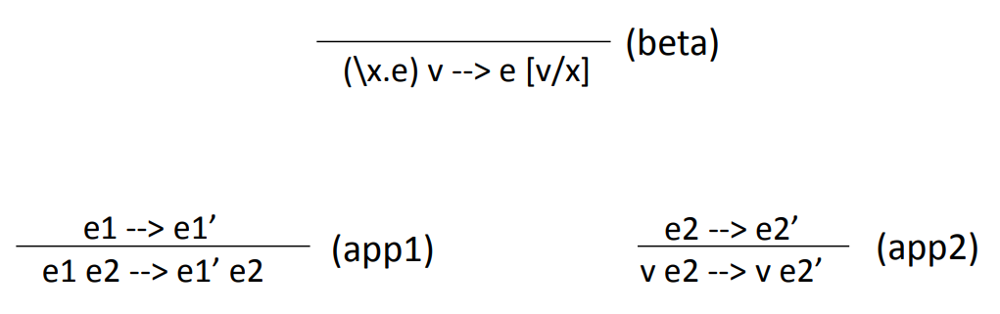

# week 7

Lambda Calculus

The Lambda Calculus involves just 3 things:

- variables `x`, `y`, `z`
- function definitions `\x.e`
- function application `e1 e2`

> Despite its simplicity, despite the apparent lack of if statements or loops or any data structures other than functions, it is Turing complete

---

- expressions: e ::= x | \x.e | e1 e2
- values: v ::= \x.e
- call-by-value operational semantics:

  

  `app2` 左边一定要是`value`
