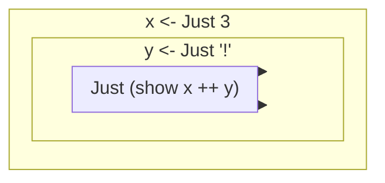

# Monad

对`compose`更为宽泛的思考

Monads are a natural extension of applicative functors

对于另一个范畴的函数进行`compose`, 直接使用的话会层层嵌套, 如`Just (Just (Just 5))`

```hs
let f = \x -> Just x in f . f . f $ 5
-- Just (Just (Just 5))
```

---

也展现了不同范畴的交互思考

---

monads are just applicative functors that support `>>=`. The `>>=` function is pronounced as _bind_.

```hs
(>>=) :: (Monad m) => m a -> (a -> m b) -> m b
```

## interface

```hs
class Monad m where
  return :: a -> m a

  (>>=) :: m a -> (a -> m b) -> m b

  (>>) :: m a -> m b -> m b
  x >> y = x >>= \_ -> y

  fail :: String -> m a
  fail msg = error msg
```

由于历史原因, 没有`class (Applicative m) = > Monad m where`, but there should

It always does the same thing as the `pure` function from the `Applicative` type class, which means we're already acquainted with `return`.

`fail`: We never use it explicitly in our code. Instead, it's used by Haskell to enable failure in a special syntactic construct for monads

> `fail`: 一般用于模式匹配当中, 失败了会被调用

```hs
do
  True <- isStart
  exec
```

If `isStart` returns `False`, `fail` will be called

---

要求的仅仅是`m`一直, 对于 a 和 b 无所谓

## do notation

`do`: gluing together monadic values in sequence

---

`->`: left associative

```hs
\x -> \y -> \z -> x + y + z
-- equals
\x y z -> x + y + z
-- similar to
let x = 1; y = 2; z = 3 in x + y + z
```

类似的

```hs
Just 3 >>= (\x -> Just "!" >>= (\y -> Just (show x ++ y)))
-- pretty
foo :: Maybe String
foo =
  Just 3
    >>= ( \x ->
            Just "!"
              >>= ( \y ->
                      Just (show x ++ y)
                  )
        )
-- syntactic sugar
foo :: Maybe String
foo = do
  x <- Just 3
  y <- Just "!"
  Just (show x ++ y)
```

`<-`相当于`>= \x`

每行语句之间相当于`->`



将横向的链式, 变为自顶而下的形式

> 想到了 js 中`Promise`用法, 用`async/await`方式来写

It's important to remember that `do` expressions are just different syntax for chaining monadic values.

---

In a do expression, every line is a monadic value.

```hs
do
  res <- Just 3 -- Maybe Int
  Nothing -- Maybe a
  a <- getStr -- Maybe str
  return (res, a) -- Maybe (Int, str)
```

!> 每行都是 monadic, 即每行都是`Maybe`. 不需要是`f:: a -> m b`, 这是针对`>>=`的, 不要搞混了

Because `do` expressions are written line by line, they may look like imperative code to some people. But the thing is, they're just sequential, as each value in each line relies on the result of the previous ones, along with their contexts (in this case, whether they succeeded or failed).

---

```hs
return (0,0) >>= landLeft 1 >>= landRight 4 >>= landLeft 2 >>= landLeft 1
-- equals
return (0, 0)
  >>= landLeft 1
  >>= landRight 4
  >>= landLeft 2
  >>= landLeft 1
-- similar
routine = do
  start <- return (0, 0)
  first <- landLeft 1 start
  second <- landRight 4 first
  third <- landLeft 2 second
  landLeft 1 third
-- equals
return (0, 0) >>= (\start
  -> landLeft 1 start >>= (\first
  -> landRight 4 first >>= (\second
  -> landLeft 2 second >>= (\third
  -> landLeft 1 third))))
```

不太一样的是, 第一种若`return (0,0) >>= landLeft 1`得到的是`Nothing`, 则后面的会执行, 一直将`Nothing`传递下去, 但是第二种则不会了

第一种为平行结构, 第二种为嵌套结构

```js
// parallel
if (){}
if (){}
if (){}
// nested
if () {
  if () {
    if () {}
  }
}
```

> 本质是 left associative and right associative

---

`>>=`: left associative

`do`: right associative

```hs
rightAssociative = do
  a <- foo
  b <- bar
  c <- baz
  return (a, b, c)
-- equals
rightAssociative = do {
  a <- foo;
  do {
    b <- bar;
    do {
      c <- baz;
      return (a, b, c)
    }
  }
}
```

基本结构就是

```hs
do {
  x <- m a;
  expr
}
```

`expr`里面可以嵌套`do`, 形成递归

类比 js

```js
Maybe.of([0, 0]).flatMap((start) =>
  landLeft(1, start).flatMap((first) =>
    landRight(4, first).flatMap((second) =>
      landLeft(2, second).flatMap((third) => landLeft(1, third))
    )
  )
);
```

---

```hs
routine :: Maybe Pole
routine = do
  start <- return (0, 0)
  first <- landLeft 2 start
  Nothing
  second <- landRight 2 first
  landLeft 1 second
-- Nothing
```

When we write a line in `do` notation without binding the monadic value with `<-`, it's just like putting `>>` after the monadic value whose result we want to ignore.

```hs
routine :: Maybe Pole
routine = do
  start <- return (0, 0)
  first <- landLeft 2 start
  _ <- Nothing
  second <- landRight 2 first
  landLeft 1 second
```

## example

### Maybe

```hs
instance Monad Maybe where
  return x = Just x
  Nothing >>= f = Nothing
  Just x >>= f = f x
  fail _ = Nothing
```

---

```hs
Just 9 >>= \x -> return (x*10)
-- Just 90
Nothing >>= \x -> return (x*10)
-- Nothing
```

It seems as though we were able to extract the value from a `Maybe` without pattern-matching. And we still didn't lose the context of our `Maybe` value, because when it's `Nothing`, the result of using `>>=` will be `Nothing` as well.

---

```hs
return (0,0) >>= landRight 2 >>= landLeft 2 >>= landRight 2
```

链式使用函数

---

We couldn't have achieved this by just using `Maybe` as an applicative. If you try it, you'll get stuck, because applicative functors don't allow for the applicative values to interact with each other very much. They can, at best, be used as parameters to a function by using the applicative style. The applicative operators will fetch their results and feed them to the function in a manner appropriate for each applicative and then put the final applicative value together, but there isn't that much interaction going on between them.

monad 可以更好地在两个范畴中交互

---

`>>`用来拦截数据

```hs
return (0,0) >>= landLeft 1 >> Nothing >>= landRight 1
-- Nothing
```

---

`Maybe`将嵌套的`if-else`转换为链式

```hs
routine :: Maybe Pole
routine = case landLeft 1 (0, 0) of
  Nothing -> Nothing
  Just pole1 -> case landRight 4 pole1 of
    Nothing -> Nothing
    Just pole2 -> case landLeft 2 pole2 of
      Nothing -> Nothing
      Just pole3 -> landLeft 1 pole3
-- equals
return (0,0) >>= landLeft 1 >>= landRight 4 >>= landLeft 2 >>= landLeft 1
```

### List

```hs
instance Monad [] where
  return x = [x]
  xs >>= f = concat (map f xs)
  fail _ = []
```

默认把`[]`排除了, `map`的原因

```txt
ghci> [] >>= \x -> ["bad","mad","rad"]
[]
ghci> [1,2,3] >>= \x -> []
[]
```

---

```hs
listOfTuples :: [(Int, Char)]
listOfTuples = do
  n <- [1, 2]
  ch <- ['a', 'b']
  return (n, ch)
-- equals
[ (n,ch) | n <- [1,2], ch <- ['a','b'] ]
```

和 List comprehension 一样

---

List comprehensions allow us to filter our output.

```hs
[ x | x <- [1..50], '7' `elem` show x ]
```

用 monad 实现

```hs
class Monad m => MonadPlus m where
  mzero :: m a
  mplus :: m a -> m a -> m a
instance MonadPlus [] where
    mzero = []
    mplus = (++)
guard :: (MonadPlus m) => Bool -> m ()
guard True = return ()
guard False = mzero
```

`mzero`的多态, 可以表现为`m ()`的类型

```hs
[1..50] >>= (\x -> guard ('7' `elem` show x) >> return x)
```

成功的话, `guard`返回`m ()`, `>>`会把`m ()`丢弃, 往后执行`return x`

失败的话, `guard`返回`mzero`, 由于`mzero`会导致不执行后续的函数, 而返回`[]`, 所以最终结果是`[]`

> 觉得 monad 在通过`>>=`维护一个隐形的对象, 剥离出核心的抽象进行处理

```hs
sevensOnly :: [Int]
sevensOnly = do
  x <- [1 .. 50]
  guard ('7' `elem` show x)
  return x
```

`guard`相当于上面的`Maybe`例子中传递一个`Nothing`

### function

```hs
instance Monad ((->) r) where
  return x = \_ -> x
  h >>= f = \w -> f (h w) w
```

其实就是`f (h w)`, 取出`h w`的值, 传递给`f`, `f`返回的本就是`m b`, 即是一个函数

---

```hs
import Control.Monad.Instances

addStuff :: Int -> Int
addStuff = do
  a <- (* 2)
  b <- (+ 10)
  return (a + b)
```

```hs
addStuff :: Int -> Int
addStuff x =
  let a = (* 2) x
      b = (+ 10) x
   in a + b
```

For this reason, the function monad is also called the reader monad. All the functions read from a common source.

### either

```hs
instance (Error e) => Monad (Either e) where
  return x = Right x
  Right x >>= f = f x
  Left err >>= f = Left err
  fail msg = Left (strMsg msg)
```

---

注意需要特化

```hs
Right 3 >>= \x -> return (x + 100) :: Either String Int
```

## law

### left identity

```hs
(return x >>= f) = f x
```

### right identity

```hs
(m >>= return) = m
```

### associativity

```hs
((m >>= f) >>= g) = (m >>= (\x -> f x >>= g))
```

`\x -> f x >>= g`相当于`\x -> (f x >>= g)`, 可以简写为`f >=> g`

类比`.`compose 运算:

```hs
(.) :: (b -> c) -> (a -> b) -> (a -> c)
f . g = (\x -> f (g x))
```

> `>=>`是从左往右的组合, `<=<`是从右往左的组合

```hs
(<=<) :: (Monad m) => (b -> m c) -> (a -> m b) -> (a -> m c)
f <=< g = (\x -> g x >>= f)
```

- identity

  ```hs
  return <=< f = f
  f <=< return = f
  ```

- associativity

  ```hs
  (f <=< g) <=< h = f <=< (g <=< h)
  ```

---

Anyway, we can compose monadic functions in the same way, only instead normal composition we use `<=<` and instead of `id` we use `return`.

## compose

```txt
ghci> let f = foldr (.) id [(+1),(*100),(+1)]
ghci> f 1
201
```

类似的

```hs
import Data.List

inMany :: Int -> KnightPos -> [KnightPos]
inMany x start = return start >>= moveX
  where
    moveX =
      foldr
        (<=<)
        return
        (replicate x moveKnight)
```

## stateful computation

```hs
newtype Writer w a = Writer {runWriter :: (a, w)}

instance (Monoid w) => Monad (Writer w) where
  return x = Writer (x, mempty)
  (Writer (x, v)) >>= f = let (Writer (y, v')) = f x in Writer (y, v `mappend` v')
```

有意思的是`runWriter`:将 record syntax 类似于真的在运行一样

确实, 取出, 就是在运行; 类比取出 IO 的 content, 其实就是在执行

```hs
import Control.Monad.Writer

logNumber :: Int -> Writer [String] Int
logNumber x = Writer (x, ["Got number: " ++ show x])

multWithLog :: Writer [String] Int
multWithLog = do
  a <- logNumber 3
  b <- logNumber 5
  return (a * b)
```

---

```hs
import Control.Monad.Writer

gcd' :: Int -> Int -> Writer [String] Int
gcd' a b
  | b == 0 = do
      tell ["Finished with " ++ show a]
      return a
  | otherwise = do
      tell [show a ++ " mod " ++ show b ++ " = " ++ show (a `mod` b)]
      gcd' b (a `mod` b)
```

```txt
ghci> mapM_ putStrLn $ snd $ runWriter (gcd' 8 3)
8 mod 3 = 2
3 mod 2 = 1
2 mod 1 = 0
Finished with 1
```

---

```hs
s -> (a,s)
```

`s` is the type of the state and `a` the result of the stateful computations.

---

`x = 5`

If you look at that functionally, you could look at it as a function that takes a state (that is, all the variables that have been assigned previously) and returns a result (in this case `5`) and a new state, which would be all the previous variable mappings plus the newly assigned variable.

This stateful computation, a function that takes a state and returns a result and a new state, can be thought of as a value with a context as well. The actual value is the result, whereas the context is that we have to provide some initial state to actually get that result and that apart from getting a result we also get a new state.

---

```hs
newtype State s a = State {runState :: s -> (a, s)}

instance Monad (State s) where
  return x = State $ \s -> (x, s)
  (State h) >>= f = State $ \s ->
    let (a, newState) = h s
        (State g) = f a
     in g newState
```

用`pop`思考的时候犯了错, `pop`针对的不是`>>=`, 而是`>>`, 或者应该把`pop`理解为`\_ -> pop`

正确的理解:`f::a->State s b`, `f a`能取出`State`

`State`是一个关系转化函数:, 需要`g newState`取出二元对, 最后通过`State $ g newState`包装进入 context

```hs
newtype State s a = State {runState :: s -> (a, s)}

instance Monad (State s) where
  return x = State $ \s -> (x, s)
  (State h) >>= f =
    State $ \s -> g newState
    where
      (a, newState) = h s
      (State g) = f a
```

---

```hs
import Control.Monad.State

pop :: State Stack Int
pop = State $ \(x : xs) -> (x, xs)

push :: Int -> State Stack ()
push a = State $ \xs -> ((), a : xs)

stackManip :: State Stack Int
stackManip = do
  push 3
  a <- pop
  pop
```

得到的是一个待初始化的函数, `State`是一个函数

> 真有一切皆函数的感觉, 一开始以为直接能得到结果, 在想初始值在哪里, 最后发现需要通过函数传递进去

```txt
ghci> runState stackManip [5,8,2,1]
(5,[8,2,1])
```

---

`f::a->State s b`, a 是函数从外部接受的输入, b 是函数到到外部的输出, State 是对状态的控制

---

```hs
return (0, 0)
  >>= landLeft 1
  >>= landRight 4
  >>= landLeft 2
  >>= landLeft 1
-- similar
routine = do
  start <- return (0, 0)
  first <- landLeft 1 start
  second <- landRight 4 first
  third <- landLeft 2 second
  landLeft 1 third
```

用 state 的角度来看

```hs
landLeft' = \n -> State $ \s -> ((), landLeft n s)
```

State 是一个函数, `f`可以思考为`a -> s0 -> (b, s1)`

则可以重写为

```hs
routine' = do
  landLeft' 1
  landRight' 4
  landLeft' 2
  landLeft' 1
```

```txt
ghci> runState routine' Just (0, 0)
((), Just (3,3))
```

非常接近于

```hs
return (0, 0)
  >>= landLeft 1
  >>= landRight 4
  >>= landLeft 2
  >>= landLeft 1
```

---

类似的, 对于`Stack`

```hs
stackManip :: State Stack Int
stackManip = do
  push 3
  a <- pop
  pop

runState stackManip [5,8,2,1]

-- equals
return [5,8,2,1]
  >>= push 3
  >> pop
  >> pop
```

---

```hs
get = State $ \s -> (s,s)

put newState = State $ \s -> ((),newState)
```

---

```hs
(>>=) :: State s a -> (a -> State s b) -> State s b
```

This means that we can glue together several stateful computations whose results are of different types but the type of the state has to stay the same.

可以像 js 一样动态类型

```js
a = 1;
a = True;
```

```hs
set 'a' 1
set 'a' True
```

---

```hs
liftM :: (Monad m) => (a -> b) -> m a -> m b
liftM f m = do
  x <- m
  return (f x)
```

```hs
ap :: (Monad m) => m (a -> b) -> m a -> m b
ap mf m = do
  f <- mf
  x <- m
  return (f x)
```

```hs
liftA2 :: (Applicative f) => (a -> b -> c) -> f a -> f b -> f c
liftA2 f x y = f <$> x <*> y
```

## join

```hs
join :: (Monad m) => m (m a) -> m a
join mm = do
  m <- mm
  m
```

---

```txt
ghci> join (Just (Just 9))
Just 9
ghci> join (Just Nothing)
Nothing
ghci> join Nothing
Nothing
```

有意思的是, `join Nothing`

---

`m >>= f` always equals `join (fmap f m)`

The fact that `m >>= f` always equals `join (fmap f m)` is very useful if we're making our own `Monad` instance for some type because it's often easier to figure out how we would flatten a nested monadic value than figuring out how to implement `>>=`.

---

```hs
keepSmall :: Int -> Writer [String] Bool
keepSmall x
  | x < 4 = do
      tell ["Keeping " ++ show x]
      return True
  | otherwise = do
      tell [show x ++ " is too large, throwing it away"]
      return False
```

```txt
ghci> mapM_ putStrLn $ snd $ runWriter $ filterM keepSmall [9,1,5,2,10,3]
9 is too large, throwing it away
Keeping 1
5 is too large, throwing it away
Keeping 2
10 is too large, throwing it away
Keeping 3
```

---

```hs
powerset :: [a] -> [[a]]
powerset xs = filterM (\x -> [True, False]) xs
```

```txt
ghci> powerset [1,2,3]
[[1,2,3],[1,2],[1,3],[1],[2,3],[2],[3],[]]
```

一开始, 猜想`filterM`的实现是

```hs
filterM' f xs = do
  x <- xs
  y <- f x
  return (if y then [x] else [])
```

```txt
ghci> filterM' (\x -> [True, False]) [1,2,3]
[[1],[],[2],[],[3],[]]
```

实际上是

```hs
filterM :: (Monad m) => (a -> m Bool) -> [a] -> m [a]
filterM _ [] = return []
filterM p (x : xs) = do
  flg <- p x
  ys <- filterM p xs
  return (if flg then x : ys else ys)
```

## foldM

```hs
binSmalls :: Int -> Int -> Maybe Int
binSmalls acc x
    | x > 9     = Nothing
    | otherwise = Just (acc + x)
```

```txt
ghci> foldM binSmalls 0 [2,8,3,1]
Just 14
ghci> foldM binSmalls 0 [2,11,3,1]
Nothing
```

## application

We don't usually set out to make a monad with the sole purpose of making a monad. Instead, we usually make a type that whose purpose is to model an aspect of some problem and then later on if we see that the type represents a value with a context and can act like a monad, we give it a `Monad` instance.

!> 不是为了 monad 而 monad. If all you have is a hammer, everything looks like a nail.
