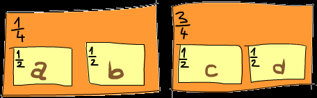

# coin

- [ ] 加入测试

  用测试描述文档

如 docTest

## question

coin toss

## model

> 概率可以看作隐形的 context

```txt
ghci> fmap negate (Prob [(3,1%2),(5,1%4),(9,1%4)])
Prob {getProb = [(-3,1 % 2),(-5,1 % 4),(-9,1 % 4)]}
```



```txt
thisSituation :: Prob (Prob Char)
thisSituation = Prob
    [( Prob [('a',1%2),('b',1%2)] , 1%4 )
    ,( Prob [('c',1%2),('d',1%2)] , 3%4)
    ]
```

- 概率是连乘的形式, 则 identity 为 1

```txt
ghci> getProb flipThree
[(False,1 % 40),(False,9 % 40),(False,1 % 40),(False,9 % 40),
 (False,1 % 40),(False,9 % 40),(False,1 % 40),(True,9 % 40)]
```

- [x] 不知道为什么运行不了

  原因是

  ```hs
  instance Monad Prob where
    return x = Prob [(x, 1 % 1)]
    m >>= f = flatten (fmap f m)
    fail _ = Prob []
  ```

  modern 版的 stack 会报错

  正确的:

  ```hs
  instance Applicative Prob where
    pure = return
    (<*>) = ap

  instance Monad Prob where
    return x = Prob [(x, 1 % 1)]
    m >>= f = flatten (fmap f m)

  instance MonadFail Prob where
    fail _ = Prob []
  ```

  !> 还需要实现`Applicative`
